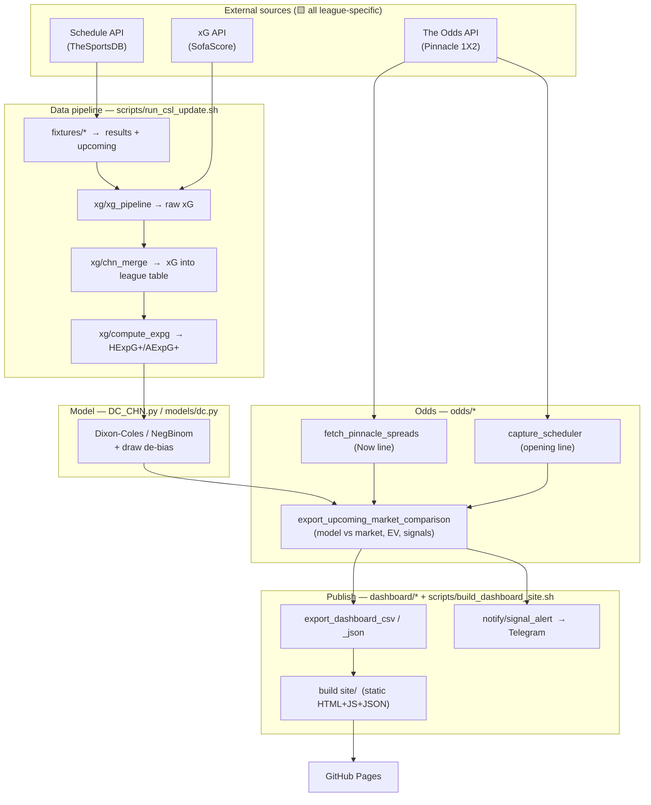

# Porting the CSL Monitor Architecture to Liga MX

**Audience:** the coding agent building the Liga MX version of this system.
**Source project:** `cslmonitor` — a Chinese Super League (CSL) match-prediction &
odds-monitoring pipeline that publishes a static dashboard to GitHub Pages.
**Goal:** stand up the *same architecture* for **Liga MX** (Mexican Primera Division),
re-parameterized for the new league.

This document is written so you can port faithfully. It separates three kinds of content:

- 🟩 **Structural** — copy the design/code as-is; it is league-agnostic.
- 🟨 **League-specific** — must be re-parameterized for Liga MX (IDs, keys, names, timezone).
  Every one of these is collected in the mapping table in [§11](#11-league-specific-parameter-mapping-csl--liga-mx).
- 🟥 **Strategy / empirical findings** — CSL *measurements*, **not** universal facts. They
  describe the betting thesis and how it was tested. **They must be re-validated on Liga MX
  data before you trust any number.** See [§13](#13-strategy--backtest-findings-reference-only--must-re-validate).

> ⚠️ **The single most important thing to internalize:** the CSL project treats one
> *continuous* league season with monotonically increasing round numbers and a rolling
> 18-month training window. **Liga MX does not work that way** — it runs two short
> tournaments per year (Apertura + Clausura) each followed by a Liguilla playoff. This
> breaks several assumptions in the fixtures / xG / opening-window code. Read
> [§12](#12-liga-mx-structural-differences-you-must-handle) *before* writing any code.

---

## 0. How to use this document

1. Read [§1](#1-what-this-system-is)–[§9](#9-automation-github-actions) to understand the whole system.
2. Follow the phased build order in [§10](#10-recommended-build-order-for-the-port).
3. Use the mapping table in [§11](#11-league-specific-parameter-mapping-csl--liga-mx) as your
   find-and-replace checklist. Nothing ships until every 🟨 row is resolved.
4. Treat [§12](#12-liga-mx-structural-differences-you-must-handle) as hard requirements, not suggestions.
5. Treat [§13](#13-strategy--backtest-findings-reference-only--must-re-validate) as reference
   only — re-run the equivalent backtests on Liga MX; do not assume CSL conclusions carry over.

The source repo also ships two long-form docs worth reading in the original:
`README.md` (operator's manual) and `AGENTS.md` (deep architecture + full strategy history).

---

## 1. What this system is

A pipeline that, on a schedule:

1. **Pulls** Liga MX fixtures & results (schedule provider).
2. **Derives xG** features per match from a stats provider.
3. **Fits a goals model** (Dixon-Coles family) on expected-goals targets with time-decay.
4. **Fetches bookmaker odds** (Pinnacle 1X2) and builds a **model-vs-market comparison**.
5. **Captures opening lines** into an append-only history (for closing-line-value analysis).
6. **Exports** dashboard datasets (CSV + JSON) and **builds a static site**.
7. **Deploys** the site to GitHub Pages and **pushes bet-signal alerts** to Telegram.

### The purpose behind it (the betting thesis)

The dashboard feeds a **CLV (closing-line-value) betting strategy**: find fixtures where the
model diverges from the market and bet +EV lines at soft/aggregator books *early*, before the
market corrects. The thesis is **not** "beat Pinnacle's close" (assumed efficient) — it is
"get down at the **opening** line at a price better than Pinnacle, and let convergence toward
the close deliver +CLV."

🟥 **Whether that edge actually exists was tested extensively on CSL and is largely negative
(see §13). Do not assume it holds for Liga MX. The value of this system for Liga MX is the same
regardless: it is the measurement apparatus that lets you find out.**

---

## 2. High-level architecture

Five layers, each a Python subpackage under `src/csl/` (you will rename the package — see §11),
orchestrated by thin shell scripts, automated by three GitHub Actions workflows.



**Data-flow in one line:**
`fixtures → xG → merge → expected-goals → model → (model ⋈ odds) → CSV/JSON → site → Pages`,
with a parallel **opening-line capture loop** appending to an odds-history CSV.

**Design principles that make it portable (🟩 keep all of these):**

- **Everything is file-based.** Each stage reads/writes CSVs under `data/`. No database. State
  lives in git. This is what makes the whole thing runnable both locally and in CI, and
  auditable via commit history.
- **Path resolution is repo-relative, not CWD-relative** (`src/csl/paths.py`). Never hardcode
  absolute paths (the one offender, `DC_CHN.py`, is called out in the source as tech debt —
  fix it in the port).
- **Wrapper scripts own the environment** (`scripts/common.sh`): activate conda, load
  `.env.local`, set `PYTHONPATH=src`. Python modules never touch env activation.
- **Single entry point** (`scripts/csl.sh <command>`) dispatches every workflow; CI calls the
  same script humans do.
- **The dashboard is a dumb static reader.** It fetches a fixed set of JSON files (the "JSON
  contract") and renders them. The backend's only obligation is to keep that contract stable.

---

## 3. Repository layout

```
cslmonitor/
├── DC_CHN.py                     # 🟨 model entry wrapper (thin; calls src/csl/models/dc.py)
├── README.md                     # operator manual
├── AGENTS.md                     # deep architecture + full strategy history
├── environment.yml               # 🟩 conda env "csl-workflows" (Python 3.11)
├── requirements.txt              # 🟩 pip deps
├── .env.local.example            # 🟨 secrets template (Odds API key, overrides)
├── scripts/
│   ├── csl.sh                    # 🟩 single dispatcher: update|model|dashboard|odds|publish|republish|all
│   ├── common.sh                 # 🟩 env bootstrap (conda + .env.local + PYTHONPATH)
│   ├── run_csl_update.sh         # 🟩 data pipeline: fixtures → xG → merge → expG
│   ├── csl-model.sh              # 🟩 runs DC_CHN.py
│   ├── build_dashboard_site.sh   # 🟩 assembles site/ from dashboard/ + data/dashboard/json/
│   ├── fetch_xg_local.sh         # 🟨 home-machine xG fetch (CI can't reach SofaScore — see §6.2)
│   └── install_local_xg.sh       # 🟨 installs a launchd/cron job for local xG refresh
├── src/csl/                      # 🟨 package name → rename (e.g. src/ligamx/)
│   ├── paths.py                  # 🟩 repo-relative path helpers
│   ├── date_utils.py             # 🟩 robust date parsing (ISO + legacy DMY)
│   ├── fixtures/chn_fixture_v5.py# 🟨 schedule fetch (TheSportsDB)
│   ├── xg/
│   │   ├── xg_pipeline.py         # 🟨 SofaScore xG fetch (tournament/season IDs)
│   │   ├── chn_merge.py           # 🟨 merge xG into league table
│   │   └── compute_expg.py        # 🟩 compute HExpG+/AExpG+
│   ├── models/dc.py               # 🟩 Dixon-Coles/NegBinom + draw de-bias (logic is league-agnostic)
│   ├── odds/
│   │   ├── fetch_pinnacle_spreads.py       # 🟨 The Odds API sport key, bookmaker, market
│   │   ├── export_upcoming_market_comparison.py  # 🟩 model⋈market, EV, bet signals
│   │   ├── opening_calendar.py             # 🟥 opening-time PATTERN (must re-validate)
│   │   ├── capture_scheduler.py            # 🟩 tick logic (in-window + not-yet-captured)
│   │   ├── capture_snapshot.py             # 🟩 quota read + snapshot helpers
│   │   ├── snapshot_store.py               # 🟩 append-only history CSV + dedup
│   │   ├── backfill_open.py                # 🟩 zero-quota fallback opening-line backfill
│   │   └── survey_bookmakers.py            # 🟥 book-overround survey (analysis tool)
│   ├── dashboard/
│   │   ├── export_dashboard_csv.py         # 🟩 emit the 5 dashboard CSVs
│   │   └── export_dashboard_json.py        # 🟩 CSV → the 5-file JSON contract
│   └── notify/signal_alert.py              # 🟩 Telegram push for new bet signals
├── dashboard/                    # 🟨 static frontend (index.html, app.js, styles.css, assets/)
├── data/
│   ├── raw_data/                 # inputs + odds history
│   ├── output_data/              # model + comparison outputs
│   └── dashboard/{csv,json}/     # dashboard datasets (json/ is what the site serves)
├── backtest/                     # 🟥 strategy backtests & findings (CSL-specific)
├── model comparison/             # 🟥 distribution/diagnostic scripts (CSL-specific)
└── .github/workflows/
    ├── csl-refresh.yml           # 🟩 dual-mode refresh (daily full + 3-hourly odds)
    ├── capture-odds.yml          # 🟩 ~10-min opening-line capture loop + gated republish
    └── deploy-pages.yml          # 🟩 build + deploy site to Pages
```

**Renaming convention:** everything `CHN_*` / `csl` / `chn` / "Chinese Super League" is a
placeholder. Pick a namespace for the new project (suggested: `MEX_*` file prefix, `ligamx`
package, `mex` short code) and apply it consistently. See the checklist in §14.

---

## 4. The data pipeline

Entry: `./scripts/csl.sh update` → `scripts/run_csl_update.sh`, three steps:

### 4.1 Fixtures & results — `fixtures/chn_fixture_v5.py`

- 🟨 Fetches from **TheSportsDB** (`BASE_URL = ".../api/v1/json/123"`, `CSL_ID = "4359"`).
  For Liga MX use league id **`4350`** (see §11). Note `123` is the API key segment in the URL
  (a shared/free key in the source) — verify it still works or supply your own.
- Fetches round-by-round for each season in `SEASONS_TO_FETCH`, parses events into a normalized
  row shape, and **applies team-name normalization** via the mapping CSV (`match_team` →
  `standard_team`). Writes `chinese_super_league_data.csv` (full results) and derives
  `chn_upcoming_fixtures.csv` (unplayed fixtures).
- 🟥 **Liga MX caveat:** the CSL fetch loops rounds within a single continuous season. Liga MX
  seasons are `Apertura YYYY` / `Clausura YYYY` short tournaments with a Liguilla. You must
  decide how "season" and "round" map (see §12.1) and adjust `SEASONS_TO_FETCH` /
  `resolve_season_string` accordingly.

**Row shape (the league-table contract)** — `chinese_super_league_data.csv`:
`Country, League, Season, Round, Date, Time, Home, Away, HG, AG, HxG, AxG, HExpG+, AExpG+, Res, PSCH, PSCD, PSCA`
(HG/AG = goals, HxG/AxG = xG, HExpG+/AExpG+ = blended expected goals, Res = H/D/A).

### 4.2 xG fetch + merge — `xg/xg_pipeline.py`, `xg/chn_merge.py`

- 🟨 Fetches xG from the **official SofaScore API** (`api.sofascore.com/api/v1`) using
  **`curl_cffi` browser impersonation** (SofaScore's Cloudflare fingerprints the TLS
  handshake; plain `requests` gets 403). **No API key.** Keyed by
  `UNIQUE_TOURNAMENT_ID = 649` (CSL) + `SEASON_ID = 90049`. For Liga MX these change — see §11
  and §12.1 (Apertura/Clausura have distinct IDs).
- Two modes: **incremental** (derive recent rounds from the cache and refresh them) and
  `--full-season` (fetch round 1 until the first empty round). Endpoint pattern:
  `/unique-tournament/{ID}/season/{SEASON_ID}/events/round/{round_num}`.
- 🟩 **Merge policy** (`chn_merge.py`): a fresh non-blank xG value always overwrites the cached
  one (SofaScore is source of truth), **but a blank scrape never erases an existing value.**
  Keep this exact semantics — it protects the historical cache from a transient empty fetch.
- 🟨 **CI can't fetch xG.** SofaScore Cloudflare-blocks datacenter IPs, so GitHub Actions sets
  `CSL_SKIP_XG_FETCH=1` and merges a **committed** `xg_data.csv` that a home machine refreshes
  on its own schedule (`scripts/fetch_xg_local.sh` + `install_local_xg.sh`). **Preserve this
  split** — it is a hard operational constraint, not an accident. (See §6.2 for the same issue
  in reverse for odds.)

**Raw xG shape** — `xg_data.csv`:
`match_id, round, date, home_team, away_team, home_score, away_score, home_xg, away_xg, status`.

### 4.3 Expected-goals blend — `xg/compute_expg.py`

- 🟩 Computes `HExpG+` / `AExpG+`, the blended expected-goals targets the model trains on
  (fixtures without a complete xG pair are later dropped from training). League-agnostic logic;
  copy as-is. Verify column names line up after your rename.

---

## 5. The model

Entry: `./scripts/csl.sh model` → `DC_CHN.py` → `src/csl/models/dc.py`.

🟩 **The modeling logic is league-agnostic — copy it wholesale.** What changes for Liga MX is
only the *data* it is fed and possibly the training-window length (§12.2).

- Fits a **Dixon-Coles-family goals model** via the `penaltyblog` package. Current production
  distribution is **`NegativeBinomialGoalModel`** (over-dispersion helps prediction; an earlier
  `ZeroInflatedPoissonGoalsModel` had collapsed to Poisson — its zero-inflation param sat at its
  floor in 100% of refits).
- **Trains on xG targets** (`HExpG+`/`AExpG+`), **not** raw scores.
- **18-month rolling window** (`df["Date"].max() - DateOffset(months=18)`), **Dixon-Coles
  time-decay weights** (`dixon_coles_weights`, `xi=0.001` — higher `xi` down-weights old
  matches faster).
- **Draw de-bias** (`DrawCalibratedModel`): every independent-goals model over-prices the draw
  (mass piles at goal-difference 0). A scalar `delta` scaling the scoreline-grid diagonal is fit
  on the training window by weighted 1X2 log-likelihood (`fit_draw_delta`) — **market-free**, so
  it works even with no odds. A **hybrid** variant (market-anchored shrink toward the no-vig
  captured-opening draw prob, `lambda=0.75`) is used on the market-comparison surface when a
  captured open exists, falling back to `delta` otherwise. The `debias_method` column records
  which path produced each row.
- **Outputs:** `CHN_team_stats.csv` (`Team, Attack, Defense, Date` — team strengths),
  `CHN_team_stats_match_simulations.csv` (per-fixture 1X2 + Asian-handicap probabilities), and
  a sidecar `CHN_model_meta.json` recording `model_updated_at` (deliberately untouched by
  odds-only refreshes so the UI can show model-fit time separately from odds-fetch time).

⚠️ **Watch-out carried over from the source:** `xi=0.001` is hardcoded in **two** places
(`dc.py`/`DC_CHN.py` and `export_upcoming_market_comparison.MODEL_XI`). The model is fit twice
per full run (model export + market comparison) on identical inputs. Keep the two `xi` values in
sync or the two exports silently use different models. Consider centralizing it in the port.

🟥 The **choice** of distribution and the de-bias parameters (`delta≈0.91`, `lambda=0.75`) were
tuned/validated on CSL. Re-check them on Liga MX (the draw-bias direction is structural and will
recur, but magnitudes differ).

---

## 6. The odds layer

### 6.1 Fetch the current ("Now") line — `odds/fetch_pinnacle_spreads.py`

- 🟨 Calls **The Odds API** with `ODDS_SPORT_KEY = "soccer_china_superleague"`, bookmaker fixed
  to **`pinnacle`**, market **`h2h`** (1X2 moneyline), `commenceTimeFrom = now` (upcoming only).
  For Liga MX: `soccer_mexico_ligamx`. **⚠️ Liga MX requires The Odds API PRO tier** (CSL was on
  the free plan) — see §12.3.
- 🟨 Team names normalized via the mapping CSV's `odds_team` → `standard_team` column.
- Writes `CHN_pinnacle_spreads.csv` (current snapshot). This is the "Now" line refreshed every
  ~3h by CI.

### 6.2 Capture the OPENING line — the capture loop

This is the project's signature piece: capturing true **opening** lines on The Odds API's
**free/cheap plan, which has no historical-odds endpoint.** The trick is to fetch a fixture's
line exactly once, right when it opens.

- 🟥 **`opening_calendar.py` — the timing pattern (must re-validate for Liga MX):** on CSL,
  Pinnacle opens a match's line within **~1h after the later of the two teams' most-recent
  matches has kicked off**. The module predicts each upcoming fixture's opening window from
  prior-round kickoffs. **This pattern is empirical and CSL-specific. You must observe Liga MX's
  actual opening cadence and re-derive the rule** (Liga MX's twice-a-week rounds and Liguilla
  legs may open on a different schedule). Until validated, widen the capture window generously.
- 🟩 **`capture_scheduler.py` — the tick (copy the logic):** runs frequently (~10 min). Each
  tick (1) builds predicted windows from local CSVs (no network), (2) finds fixtures whose
  window contains "now" **and** that have no `snapshot_type=open` row yet ("pending"), (3) if
  none pending, exits spending **zero** API quota, (4) otherwise spends **one** `/odds` request
  (the whole slate returns at once), keeps only pending fixtures' rows, appends them as `open`.
  A **quota guard** reads remaining quota from the free `/sports` endpoint and aborts below a
  threshold. **The capture window is intentionally wider than the ~1h display window** — a
  fixture's feed entry can appear only after its 1h window closes, and a too-tight bound loses
  the opening line forever.
- 🟩 **`snapshot_store.py`** — append-only history CSV with a dedup key; **`backfill_open.py`** —
  zero-quota safety net: any fixture with a Now line but no captured open whose window has closed
  gets its current line stored as a *fallback* open (reuses the already-fetched Now CSV, no
  extra request).

**Odds-history shape** — `CHN_pinnacle_spreads_history.csv`:
the fetch columns plus `snapshot_type` (`open`/…), `target_round`, `capture_reason`.

### 6.3 Model-vs-market comparison — `odds/export_upcoming_market_comparison.py`

- 🟩 Joins model probabilities to the market line, computes **EV** per outcome, and emits **bet
  signals** (`signal_pick`, `signal_state`). The signal rule on CSL: EV above a threshold **and**
  odds ≤ a cap (`SIGNAL_ODDS_CAP = 7`) → a `bet` signal. Also carries a second book's opening
  line (CSL used 1xBet as the cheaper execution venue) for the EV that actually matters at the
  execution price.
- 🟥 The **thresholds, the odds cap, and the choice of execution book** are strategy parameters
  tuned on CSL. Re-decide them for Liga MX (§13).

**Comparison shape** — `CHN_upcoming_market_comparison.csv` (drives the whole dashboard's EV
view): `fixture_id, round, match_date, match_time, kickoff_at, home_team, away_team,
home_win_prob, draw_prob, away_win_prob, debias_method, home_odds, draw_odds, away_odds,
bookmaker, market, regions, last_update, fetched_at, onexbet_open_*_odds, onexbet_open_*_ev,
open_*_odds, signal_pick, signal_state`.

---

## 7. The dashboard

🟩 A **fully static** site — no server, no build step beyond copying files. `dashboard/` holds
`index.html`, `app.js` (vanilla JS, no framework), `styles.css`, `assets/`. It's styled as a
"Bloomberg-style terminal" with F1–F5 tabs (Overview / EV Bet / Schedule / Team Strength /
Model).

**The JSON contract (this is the backend↔frontend interface — keep it stable):** `app.js`
fetches exactly five files, trying `./data` (built site) then `../data/dashboard/json` (local
repo run):

- `dashboard_meta.json` — competition code/name, season, timezone, current/total rounds,
  matches played, next fixture date, model name/version, `updated_at`, `model_updated_at`.
- `upcoming_fixtures.json`
- `match_predictions.json`
- `team_strength_rankings.json`
- `upcoming_market_comparison.json`

`export_dashboard_csv.py` emits the five CSVs; `export_dashboard_json.py` converts them to the
five JSON files (with a cross-file `season` consistency check). `build_dashboard_site.sh` then
`rm -rf site/`, copies `dashboard/` into `site/`, and copies the JSON into `site/data/`. That
`site/` directory is what GitHub Pages serves.

🟨 **Frontend changes for Liga MX:** title ("CSL Terminal"), masthead ("Chinese Super League ·
Season …"), logo (`assets/csl-logo.png`), the display timezone constant (`DISPLAY_TZ =
"Europe/London"` in `app.js`), and the execution-book link (`ONEXBET_LEAGUE_URL`). The
data-binding and rendering logic is 🟩 — it just reads the contract.

⚠️ **Mobile:** the source notes that synced designs were desktop-first and text overlapped at
375px due to flex `min-width:0` collapse. **Screenshot a 375px viewport before shipping any
layout.**

---

## 8. Notifications — `notify/signal_alert.py`

🟩 Pushes a **Telegram** message the moment a *new* `bet` signal appears, so a signal reaches
the user without them opening the dashboard. Runs right after the market-comparison export in
every publish path.

- **Dedup baseline = the previously committed comparison CSV** (`git show HEAD:<csv>`): a
  fixture+pick already firing there is not re-notified. Dedup is keyed on
  `(fixture_id, signal_pick)`, not odds (a price move on an already-notified pick is not re-sent).
- **Fail-open by design:** missing token / unreachable Telegram / unreadable baseline → log and
  return without raising. The notifier can *never* fail a publish. On the first-ever run (no
  baseline) it sends nothing (avoids a blast of every currently-firing signal).
- 🟨 Config via env: `TELEGRAM_BOT_TOKEN`, `TELEGRAM_CHAT_ID` (GitHub Actions secrets). Unset →
  the module no-ops. `DISPLAY_TZ` and the execution-book URL are league-specific.

---

## 9. Automation (GitHub Actions)

Three workflows. 🟩 The *design* (triggers, gating, concurrency, push-race handling) is
league-agnostic and is the hardest-won part of the system — copy it carefully.

### 9.1 `csl-refresh.yml` — dual-mode refresh

- **`full`** (daily cron, `17 9 * * *` Europe/London): `./scripts/csl.sh all` — data + model +
  odds + dashboard + site.
- **`odds`** (every 3h cron, `0 */3 * * *` UTC): re-fetch the Now line + `publish` (rebuild site
  without re-modeling). Also runs the zero-quota fallback open backfill.
- Shares a cached conda env; one commit/push path; a pre-spend **quota check** skips the odds
  refresh when remaining < 50. `CSL_SKIP_XG_FETCH=1` here (CI can't reach SofaScore).

### 9.2 `capture-odds.yml` — the ~10-min capture loop

- **Primary trigger is an external timer** POSTing a `repository_dispatch` every ~10 min, because
  GitHub's `schedule` cron is heavily throttled (measured median ~78 min between landed runs —
  wider than the capture window). The `schedule: */10` is kept only as a fallback heartbeat. (See
  `SETUP_ALERTS.md` in the source for the external-timer setup.)
- The `capture` job runs the tick with **lightweight deps only** (`pandas` + `requests`, no
  conda/model) for a fast cheap run, appends to the history CSV, and pushes with a
  **pull-rebase-retry loop** (the append-only change rebases cleanly against concurrent writers).
- A **gated `publish` job** rebuilds + redeploys the site **only when the tick actually appended
  a new opening line** (`appended == 'true'`) — idle ticks never redeploy.

### 9.3 `deploy-pages.yml` — build & deploy

- Triggers: pushes to `main` touching site-relevant paths, **`workflow_run` after "CSL Refresh"**
  (the daily refresh pushes with `GITHUB_TOKEN`, which by GitHub's anti-recursion rule never
  fires `push` workflows — so chain off the run instead), and manual dispatch.

⚠️ **Three production gotchas the source learned the hard way — reproduce all three:**

1. 🟩 **`concurrency: cancel-in-progress: false` on the `pages` group.** Cancelling a Pages
   deploy mid-flight leaves the backend half-finished and the next run fails with "Deployment
   failed, try again later." **Queue deploys; never cancel them.** (Both `deploy-pages.yml` and
   `capture-odds.yml`'s publish job share the `pages` group so they can't clobber each other.)
2. 🟩 **Every auto-commit uses a pull-rebase-retry push loop.** `main` moves under you (a 10-min
   capture tick lands a history-only commit while a refresh runs). Changes touch different files
   so rebases are conflict-free; the retry just closes the pull→push race.
3. 🟩 **Use `[skip ci]` on capture commits** but **not** on refresh commits (whose Pages deploy
   chains via `workflow_run`, not the push). Getting this wrong either loops or fails to deploy.

---

## 10. Recommended build order for the port

Build in phases. Ship a working MVP first; add the production hardening once the core loop is
green. Each phase is independently verifiable.

### Phase 0 — Scaffold & rename (do this first)
- Copy the repo structure. Choose the namespace (`MEX_*`, `ligamx`, `mex`) and apply the §14
  checklist. Set up `environment.yml` / `requirements.txt` (they're league-agnostic) and
  `.env.local.example`. Fix `DC_CHN.py`'s absolute paths to use `paths.py` while you're in there.

### Phase 1 — Data pipeline (MVP core)
- Resolve the 🟨 source IDs (§11): TheSportsDB `4350`, SofaScore Apertura/Clausura IDs + season
  IDs, timezone. Build the team-name mapping CSV (§12.4). Get `update` producing a clean league
  table with xG and `HExpG+`/`AExpG+`. **Verify:** a fixtures CSV + a populated xG cache.

### Phase 2 — Model
- Run the model on the Liga MX table; sanity-check team strengths and probabilities. Re-check
  the training-window length for the Apertura/Clausura structure (§12.2). **Verify:**
  `*_team_stats.csv` + per-fixture probabilities that pass a smell test.

### Phase 3 — Odds + comparison
- Wire The Odds API (`soccer_mexico_ligamx`, **PRO tier**). Produce the market-comparison CSV
  with EV + signals. **Verify:** upcoming fixtures show model probs alongside Pinnacle odds.

### Phase 4 — Dashboard + deploy (end of MVP)
- Re-skin the frontend, export the JSON contract, build `site/`, deploy `deploy-pages.yml`.
  **Verify:** a live GitHub Pages URL rendering real fixtures. **This is a shippable MVP.**

### Phase 5 — Opening-line capture loop (hardening)
- Port `snapshot_store` / `capture_scheduler` / `backfill_open` as-is. **Re-validate the
  opening-time pattern** (`opening_calendar.py`) against observed Liga MX opens before trusting
  narrow windows — start wide. Add `capture-odds.yml` + the external timer.

### Phase 6 — Refresh automation + alerts (hardening)
- Add `csl-refresh.yml` (dual-mode) and `notify/signal_alert.py` (Telegram). Reproduce the three
  CI gotchas in §9. Set up the local-machine xG refresh job (§6.2).

### Phase 7 — Strategy validation (ongoing, not a code task)
- Re-run the equivalent backtests on Liga MX (§13). Decide the real signal thresholds, the
  cheapest execution book, and whether any edge survives the vig wall — **for Liga MX**, from
  Liga MX data.

---

## 11. League-specific parameter mapping (CSL → Liga MX)

Your find-and-replace checklist. **Confirmed** values were verified via web search on
2026-07-19; **TODO** values require the agent to resolve them (usually by hitting the provider's
API and reading the response). Nothing ships until every row is resolved.

| What | Where (source file) | CSL value | Liga MX value | Status |
|---|---|---|---|---|
| Schedule provider league id | `fixtures/chn_fixture_v5.py` `CSL_ID` | `4359` | **`4350`** (Mexican Primera League) | ✅ Confirmed |
| TheSportsDB URL key segment | `fixtures/chn_fixture_v5.py` `BASE_URL` | `.../json/123` | verify `123` works or use own key | ⚠️ Verify |
| SofaScore unique-tournament id | `xg/xg_pipeline.py` `UNIQUE_TOURNAMENT_ID` | `649` | Apertura **`11621`** / Clausura **`11620`** (unified Liga MX page is `352`) — confirm which the `/season/{id}/events/round` endpoint expects | ⚠️ TODO (candidates confirmed) |
| SofaScore season id | `xg/xg_pipeline.py` `SEASON_ID` | `90049` (2025/26) | **resolve current-season id via the API** per tournament | 🔲 TODO |
| The Odds API sport key | `odds/fetch_pinnacle_spreads.py` `ODDS_SPORT_KEY` | `soccer_china_superleague` | **`soccer_mexico_ligamx`** — **⚠️ requires PRO tier** | ✅ Confirmed |
| Bookmaker | `odds/fetch_pinnacle_spreads.py` | `pinnacle` | `pinnacle` (verify it lists Liga MX) | 🟩 Same |
| Market | `odds/fetch_pinnacle_spreads.py` | `h2h` (1X2) | `h2h` | 🟩 Same |
| Execution book link | `dashboard/app.js`, `notify/signal_alert.py` | 1xBet CSL URL | choose cheapest Liga MX book (§13) | 🔲 TODO |
| Display timezone | `app.js`, `notify`, `opening_calendar.py`, `export_dashboard_csv.py`, `DC_CHN.py` | `Europe/London` | decide: `America/Mexico_City` (local) or keep user's tz | 🔲 Decide |
| Source-CSV time semantics | `export_dashboard_csv.py`, `opening_calendar.py` | stored as **UTC** (GMT, no DST) | **re-verify** what TheSportsDB returns for Liga MX | ⚠️ Verify (§12.5) |
| Opening-time pattern | `odds/opening_calendar.py` | "~1h after later team's last kickoff" | **re-observe & re-derive** | 🟥 Re-validate (§6.2) |
| Team-name mapping | `data/output_data/*_team_name_mapping.csv` | 16 CSL clubs, 4 cols | build for 18 Liga MX clubs | 🔲 TODO (§12.4) |
| File prefix | everywhere | `CHN_` | e.g. `MEX_` | 🔲 Rename |
| Package name | `src/csl/` | `csl` | e.g. `ligamx` | 🔲 Rename |
| Conda env name | `environment.yml`, `common.sh` `CSL_ENV_NAME` | `csl-workflows` | e.g. `ligamx-workflows` | 🔲 Rename |
| Competition meta | `dashboard_meta.json` producers | `CSL` / "Chinese Super League" / 30 rounds | `MEX` / "Liga MX" / round count per tournament | 🔲 TODO |
| Secrets (GH Actions) | workflows | `THE_ODDS_API_KEY`, `TELEGRAM_*` | same names, new values (PRO key) | 🟨 Re-provision |

**Sources for the confirmed values:**
[The Odds API — Sports list](https://the-odds-api.com/sports-odds-data/sports-apis.html) ·
[SofaScore Liga MX Apertura (11621)](https://www.sofascore.com/football/tournament/mexico/liga-mx-apertura/11621) ·
[SofaScore Liga MX Clausura (11620)](https://www.sofascore.com/football/tournament/mexico/liga-mx-clausura/11620) ·
[SofaScore Liga MX (352)](https://www.sofascore.com/football/tournament/mexico/liga-mx/352) ·
[TheSportsDB Mexican Primera League (4350)](https://www.thesportsdb.com/league/4350-mexican-primera-league)

> How to resolve the SofaScore season id (🔲): call
> `https://api.sofascore.com/api/v1/unique-tournament/{ID}/seasons` (with `curl_cffi`
> impersonation) and pick the current season's `id`. Do the same reconnaissance the CSL author
> did — don't guess numeric IDs.

---

## 12. Liga MX structural differences you MUST handle

These are the places where "port the CSL code" is **not** a mechanical rename. They stem from
how Liga MX's calendar and providers differ from CSL's.

### 12.1 Apertura / Clausura / Liguilla (the big one)
CSL = one continuous 30-round season, round numbers increasing monotonically, one SofaScore
season id. **Liga MX = two short tournaments per calendar year** (Apertura Jul–Dec, Clausura
Jan–May), **each with its own SofaScore tournament/season id**, **each followed by a Liguilla
playoff** (two-legged ties, not a linear round schedule). Consequences to design for:
- `SEASONS_TO_FETCH` and season resolution must iterate Apertura+Clausura, not one season.
- The xG `--full-season` "rounds 1..first-empty" loop still works within a regular-phase
  tournament, but **Liguilla fixtures are not sequential rounds** — decide whether to include
  playoffs in training at all (they're few and high-variance; the CSL 18-month window would
  naturally include them if present).
- `dashboard_meta.json`'s `current_round` / `total_rounds` need a per-tournament definition.
- The model's rolling 18-month window will span multiple Apertura/Clausura tournaments — that's
  fine and probably desirable (more training data), but confirm team-strength continuity across
  the tournament boundary is what you want.

### 12.2 Training window
The 18-month window is a CSL choice. It happens to span multiple Liga MX tournaments, which is
good for sample size. Keep 18 months as the default but be ready to tune `xi`/window once you see
Liga MX fit quality (§5).

### 12.3 The Odds API PRO tier (cost + quota)
🟥 **`soccer_mexico_ligamx` is a PRO-tier sport on The Odds API; CSL was on the free plan.** This
changes the economics the whole capture loop was built around:
- The free-plan "spend one request per opening window, guard the quota" discipline still applies,
  but your quota ceiling and cost are different. Re-tune `--min-remaining` and the refresh
  cadence to your plan.
- Confirm whether your PRO plan exposes the **historical-odds endpoint**. If it does, the entire
  `opening_calendar` + `capture_scheduler` timing dance may be unnecessary — you could query
  historical opens directly. **Evaluate this before porting Phase 5**; it could delete a whole
  subsystem.

### 12.4 Team-name normalization
Four name spaces must be reconciled per club (the mapping CSV columns): `match_team`
(TheSportsDB), `odds_team` (The Odds API), `sofa_team` (SofaScore), `standard_team` (your
canonical name). Liga MX has 18 clubs with lots of naming variance ("Club América" vs "America"
vs "Club America", "CF Monterrey" vs "Monterrey", "Atlético San Luis", accents, "Guadalajara"
vs "Chivas"). **Build this mapping carefully by hitting each provider once and eyeballing the
names** — a wrong mapping silently drops a team's odds or xG.

### 12.5 Timezone / DST
CSL's source CSV times are stored as **UTC (GMT without DST)** and converted to `Europe/London`
for display (so summer BST adds +1h). **Two things to re-verify for Liga MX:**
- What timezone TheSportsDB actually returns for Liga MX kickoffs (don't assume UTC — verify
  against a known kickoff).
- What display timezone you want (`America/Mexico_City` observes DST differently than the UK;
  Mexico largely abolished DST in 2022). Get the `_parse_kickoff` / display conversion right or
  every opening-window prediction is offset.

---

## 13. Strategy & backtest findings (REFERENCE ONLY — must re-validate)

🟥 **Everything in this section is a CSL measurement. It tells you what the system is *for* and
which experiments to re-run — it does NOT tell you what is true for Liga MX. Re-run the
equivalent backtests on Liga MX data before betting a peso.**

**The thesis.** Success is long-run **+CLV** (closing-line value vs Pinnacle close), not per-bet
wins. Bet early at soft/aggregator books before the market corrects. "Bet early ⇒ +CLV" is an
*assumption* whose sign depends on model quality.

**What CSL testing found (why you must not assume it transfers):**
- **Asian-handicap edge: falsified.** No EV threshold beat zero; realized ROI worsened the more
  selective the filter — a **winner's-curse / selection-bias** signature, not a fixable
  distribution defect. (Reshaping the goal distribution cannot fix selection bias.)
- **1X2 as-specified: dead, but the direction survived a bug fix.** ~61% of stake sat on a **draw
  over-pricing bug** (model draw ≈0.28 vs actual ≈0.24). Dropping the draw tripled excess CLV and
  it stayed positive across three seasons — but still didn't clear the vig.
- **Two rules that must gate ANY future CLV claim (apply these to Liga MX too):**
  1. **Compute the model-free baseline.** On CSL, "always bet home" scored **+0.91pp CLV**,
     *better* than the model's raw number — the market drifts home every season and the model
     inherited that for free. **Report excess CLV (model − same-outcome/same-season drift), never
     raw.**
  2. **The vig wall: EV>0 ⟺ CLV > p × R.** With CSL's ~7.55% opening overround, breakeven needed
     **CLV > 2.61pp**. Everything the model knew was worth ~2–3pp; the vig ate it.
- **The one surviving direction: pay less, don't predict better.** The same CLV that loses into a
  7.5% overround wins into a ≤5% book. So the live play is **line timing + cheapest venue** —
  catch the earliest, softest opening line at a low-overround book — not better prediction. On
  CSL, 1xBet was the only cheap traditional book found (~4.76%); exchanges were cheaper but charge
  commission.

**For Liga MX you must independently:** (a) backfill opening+closing lines, (b) survey book
overrounds to find the cheapest execution venue and its breakeven CLV bar, (c) compute the
model-free baseline for *this* market's drift, (d) only then judge whether any signal clears the
wall. The source's `backtest/` and `model comparison/` directories are the templates for these
experiments — port the *methodology*, not the *conclusions*.

---

## 14. Renaming / cleanup checklist

- [ ] `src/csl/` → `src/<pkg>/`; update all `from csl...` imports and `PYTHONPATH`.
- [ ] `CHN_*` file prefixes → `<PREFIX>_*` (raw, output, dashboard CSVs; team-name mapping;
      model meta json).
- [ ] `DC_CHN.py` → `DC_<CODE>.py` (and fix its hardcoded absolute paths to use `paths.py`).
- [ ] `scripts/csl.sh`, `run_csl_update.sh`, `csl-model.sh`, `common.sh` — rename or keep names
      but update `CSL_*` env vars, `CSL_ENV_NAME`, help text, dispatch labels.
- [ ] `environment.yml` env name `csl-workflows` → your env; `requirements.txt` unchanged
      (verify `curl_cffi`, `penaltyblog`, `pandas`, `requests` are present).
- [ ] `chn_fixture_v5.py`, `chn_merge.py` — rename modules + update the module paths referenced
      in scripts.
- [ ] Frontend: `<title>`, masthead text, logo asset, `DISPLAY_TZ`, execution-book URL,
      competition strings.
- [ ] Workflows: names ("CSL Refresh"), the `workflow_run` reference in `deploy-pages.yml` (must
      match the refresh workflow's `name:` exactly), cron timezones, secret names.
- [ ] `dashboard_meta.json` producers: `competition_code`, `competition_name`, round counts,
      `model_name`/`model_version`.
- [ ] Docs: rewrite `README.md` / `AGENTS.md` for Liga MX (keep the structure; replace the
      strategy findings with "TBD — re-validation pending").
- [ ] Grep sweep before shipping: `grep -rniE 'csl|chn|china|chinese|london|649|90049|4359|
      soccer_china' .` should return **zero** un-ported hits.

---

## Appendix — quick command reference (unchanged semantics after rename)

```bash
./scripts/csl.sh update     # fixtures → xG → merge → expG
./scripts/csl.sh model      # fit model, export team stats + simulations
./scripts/csl.sh odds       # fetch Pinnacle Now line + backfill open + market comparison
./scripts/csl.sh dashboard  # export dashboard CSV + JSON
./scripts/csl.sh publish    # dashboard export + notify + build site/
./scripts/csl.sh republish  # rebuild comparison + site WITHOUT spending an /odds request
./scripts/csl.sh all        # full workflow (needs THE_ODDS_API_KEY)
```

Underlying modules (run as `python -m <pkg>.<module>` with `PYTHONPATH=src`) are listed per
layer in §4–§8. Start from `README.md` and `AGENTS.md` in the source repo for the original,
authoritative descriptions.
